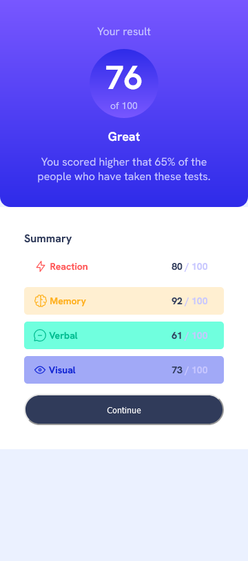
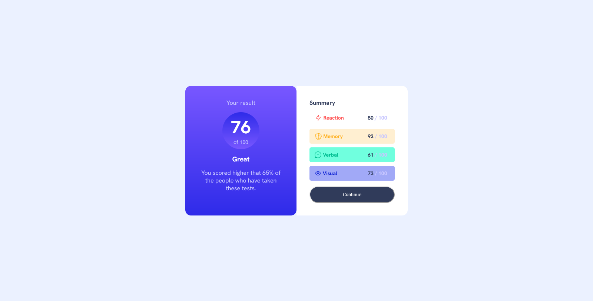

# Frontend Mentor - Results summary component solution

This is a solution to the [Results summary component challenge on Frontend Mentor](https://www.frontendmentor.io/challenges/results-summary-component-CE_K6s0maV). Frontend Mentor challenges help you improve your coding skills by building realistic projects.

## Table of contents

- [Frontend Mentor - Results summary component solution](#frontend-mentor---results-summary-component-solution)
  - [Table of contents](#table-of-contents)
  - [Overview](#overview)
    - [The challenge](#the-challenge)
    - [Screenshot](#screenshot)
    - [Links](#links)
  - [My process](#my-process)
    - [Built with](#built-with)
    - [What I learned](#what-i-learned)
    - [Continued development](#continued-development)
    - [Useful resources](#useful-resources)
  - [Author](#author)

## Overview

### The challenge

Users should be able to:

- View the optimal layout for the interface depending on their device's screen size
- See hover and focus states for all interactive elements on the page
- **Bonus**: Use the local JSON data to dynamically populate the content

### Screenshot

**Mobile Version**

**Desktop Version**

### Links

- Solution URL: [https://github.com/isaacohenedanso/result-summary-component](https://github.com/isaacohenedanso/result-summary-component)
- Live Site URL: [https://result-summary-component-sable-six.vercel.app/](https://result-summary-component-sable-six.vercel.app/)

## My process

### Built with

- Semantic HTML5 markup
- CSS custom properties
- Flexbox
- Mobile-first workflow
- Sass

### What I learned

I learnt and mastered how to use the fetch api to get data from the data.json file and then insert those data into the webpage

### Continued development

This was a cool project, however i hope to finish projects like this quite faster

### Useful resources

## Author

- Website - [Isaac Danso]()
- Frontend Mentor - [@isaacohenedanso](https://www.frontendmentor.io/profile/isaacohenedanso)
